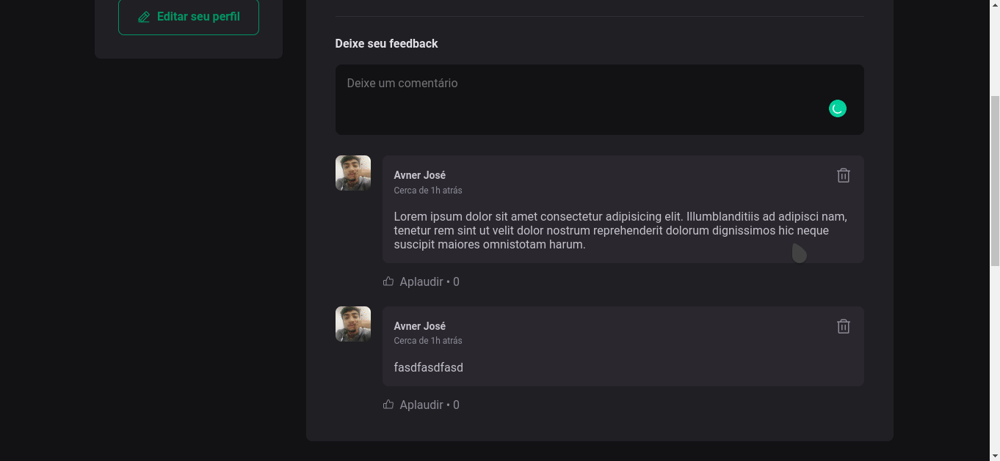

<h1 align="center">
   
</h1>
<h1 align="center" widht="50%">
  
  
</h1>

## ⚡️ The Project
 Ignite Feed is a simple react application in which you are able to list posts and add comments to theses posts. 
                         
## 🖥️ Used Tecnologies
 - [ReactJS](https://reactjs.org/)
 - [Typescript](https://www.typescriptlang.org/)
 - [Vite](https://vitejs.dev/)
 
## ⚙️ Dependencies
 - [Node](https://nodejs.org/)
 
## 🚀️ Getting Started

1. Clone this repository: 

```bash
git clone https://github.com/avnerjose/reactjs-ignite-feed.git && cd reactjs-ignite-feed
```
2. Install all dependencies

```bash
npm i
```
3. Start the app
```bash
npm run dev
```
4. Open [localhost:5173](http://localhost:5173) to see the app working